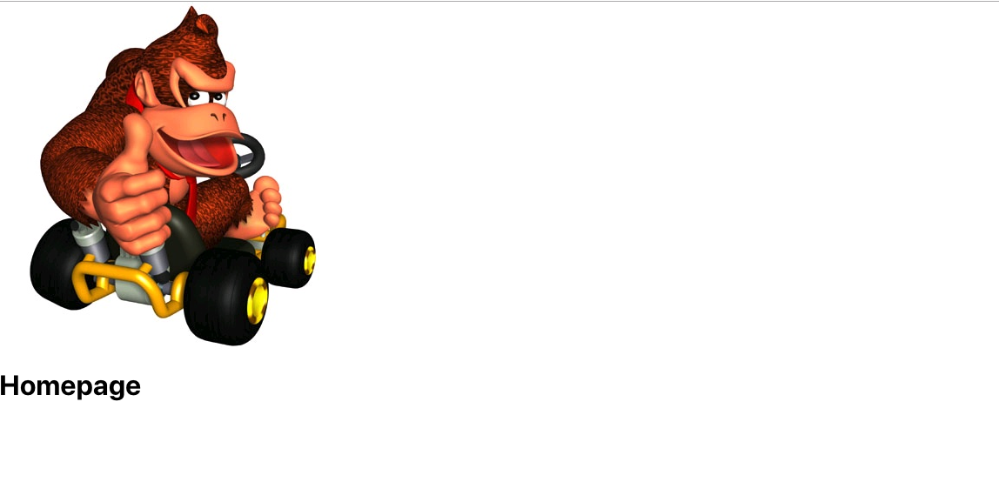
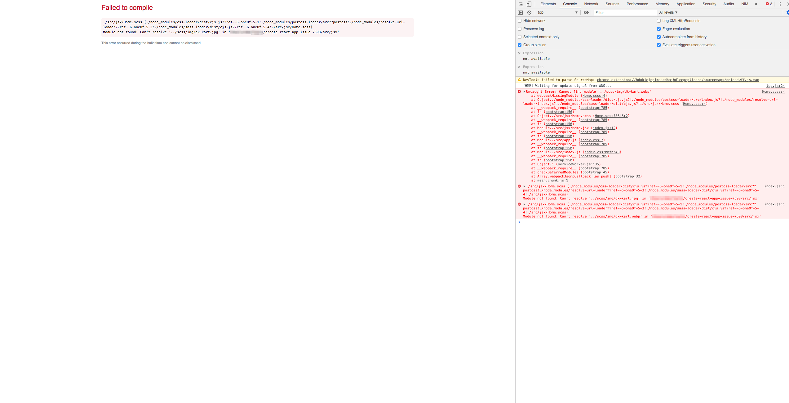

This repo exists to reproduce a bug introduced with version 3.1.x of create-react-app. The issue is that mixins (which make use of a path) imported from a different file do not honour the path of the file that uses them.

**It is still broken with version 3.3.1, which claims to have fixed it.**

# "Original" code
This code reflects the directory structure of the codebase where I experienced the problem. (This does NOT work with 3.3.x of create-react-app, but it does with 3.0.x.)

```scss
// /src/scss/mixins.scss

@mixin next-gen-image ($file-name, $fallback-ext) {
  .webp-supported & {
    background-image: url('#{$file-name}.webp');
  }

  .webp-not-supported & {
    background-image: url('#{$file-name}.#{$fallback-ext}');
  }
}
```

```scss
// /src/jsx/Home.scss

@import './../scss/mixins';

.donkey-kong {
  @include next-gen-image('img/dk-kart', 'jpg');
  height: 300px;
  width: 300px;
}

```

with the image located at `/src/jsx/img/dk-kart.jpg`.

## Expected Behaviour
Should show DK.




## Actual Behaviour
Fails to compile.




# Other attempts

Using absolute paths allows the code to compile, but the element does not have a background image:

```scss
@include next-gen-image('/jsx/img/dk-kart', 'jpg');
```

OR

```scss
@include next-gen-image('/jsx/img/dk-kart', 'jpg');
```
